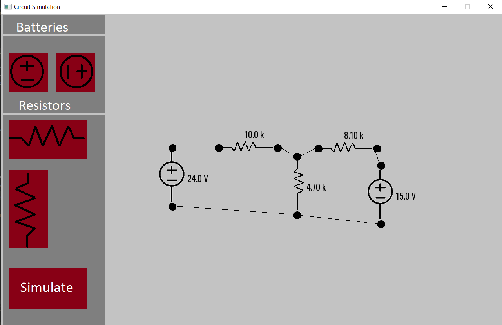
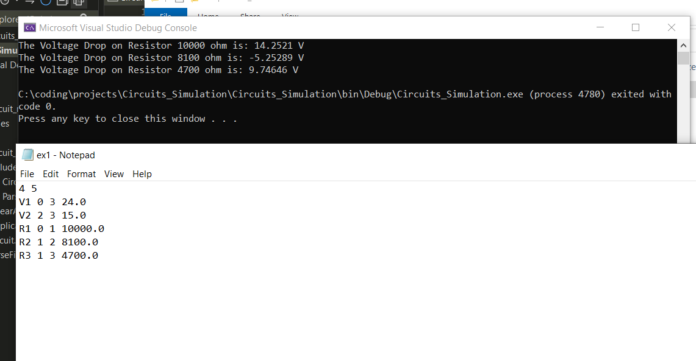
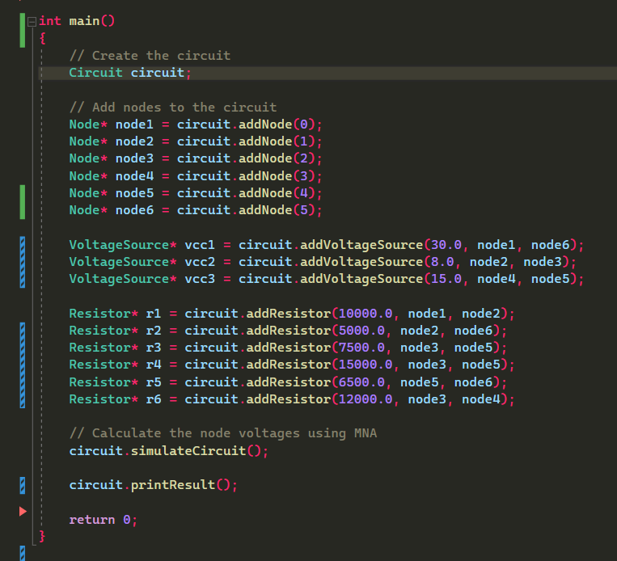
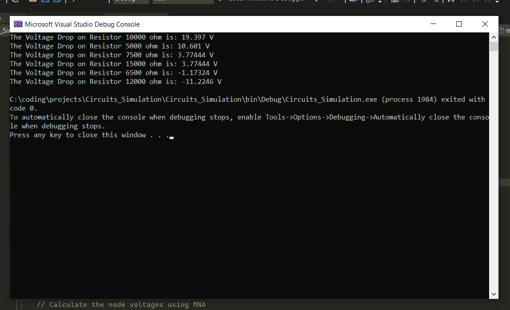

# Circuit Simulation

This project is a Circuit Simulation application built with C++ and SFML for GUI. It provides three modes of operation: GUI mode, Netlist mode, and Hardcoded mode. The simulation uses Modified Nodal Analysis (MNA) to calculate the voltages on each node and the voltage drop at each component.

## Features

- Graphical User Interface (GUI) mode: Allows users to interactively build circuits by dragging and dropping components, connecting them with wires, and visualizing voltage drops.
- Netlist mode: Enables reading circuit descriptions from a text file using the "Netlist" format, allowing for the creation of complex circuits.
- Hardcoded mode: Provides the ability to hardcode the circuit components and connections using pointers in the `Application.cpp` file.

## Dependencies

- C++: The project is written in C++ and requires a C++ compiler.
- SFML: The Simple and Fast Multimedia Library (SFML) is used for GUI and graphics rendering. Make sure SFML is properly installed on your system.

## Usage

### GUI Mode

1. Run the application and enter the GUI mode.
2. Use the mouse to drag and drop components onto the circuit canvas.
3. Connect the components using wires by clicking and dragging from one component's terminal to another.
4. Visualize the voltage drops at each component.

### Netlist Mode

1. Create a text file with the circuit description in Netlist format. Example:
    
   `V1 N1 N2 5.0`
    
   `R1 N2 N3 1000`
    
   `R2 N2 N4 2000`
    

2. Run the application and enter the Netlist mode, specifying the path to the circuit description file.
3. The circuit will be constructed based on the provided Netlist, and the voltage drops will be calculated and displayed.

### Hardcoded Mode

1. Open the `Application.cpp` file.
2. Modify the code to hardcode the circuit components and connections using the provided classes (Node, Component, Resistor, VoltageSource, Circuit).
3. Run the application and enter the Hardcoded mode.
4. The circuit will be constructed based on the hardcoded components and connections, and the voltage drops will be calculated and displayed.

## Running the Project

To run the project, follow these steps:

1. Clone the repository or download the source code.
2. Go to this path `Circuits_Simulation/bin/Release`
3. Run the `Circuits_Simulation.exe` file and you are ready to go.

## Sample Runs

### GUI Mode

### Netlist Mode

### Hardcoded Mode

## License

This project is licensed under the [MIT License](LICENSE).
